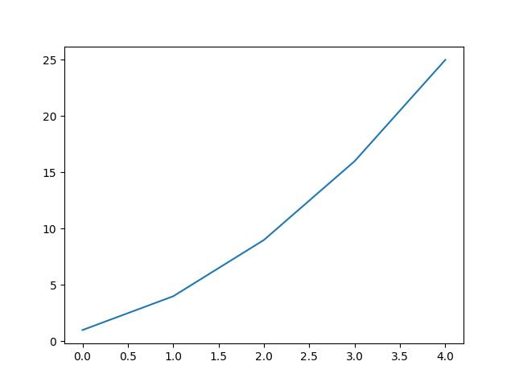

所謂*數據可視化*就是將數據弄成更加直觀的圖，*數據挖掘*就是用代碼來探索數據的規律。數據可以説一個小型數字列表，也可以是多字節的數據。
用到的東西有：python, matplotlib庫, Pygal庫

之前chatgpt幫了不少忙，這次卻一再幫倒忙。畢竟這種‘早年項目’大家都做過，直接csdn反而應有盡有，比方説json文件、bmp圖片（skr~），以及這次import報紅，原因很簡單：包已經廢棄或更新。chatgpt的回答是`pip upgrade`。我當然不能對一個語言模型過分苛責，這是自己考慮的情況不夠多，也太過於依賴chatgpt，合該有此情況。

## 牛刀小試
* 快速的華個折綫圖：



再慢慢引入新東西


爲什麽4對應25呢？大概是從0開始索引的吧，那就把x和y兩個list都傳進去：


* 然後是scatter：


一個很重要的color_map，即用不同顔色來區分某種量。思路是將color參數c弄成列表，與值域相同，指定cmap


## 隨機漫步
*按：圖可能有點多，可以看一下圖的名稱，基本意思都在裏面*
這裏代碼很好理解，就是每次該變量加上原來數組的位置，主要是要理解代碼對解決數學問題的幫助。


爲了表達出運動痕跡，巧妙地用顔色的濃淡變化來顯示，厲害！


## 擲骰子
用pygal包生成可縮放的矢量圖，這個好處就是能夠自如地scale以適應屏幕，所以適合放在online的網頁上。


這個圖片在瀏覽器中打開個空白頁，將它拖進去，然後鼠標懸停后會顯示相應的信息，真個不錯！


既然程序生成隨機數這麽容易又快速，自然也可以來求pi的近似值，這就是蒙特卡洛思想的核心。

## 下載數據，然後可視化
主要集中於csv與json文件。
所謂csv文件，無他，就是以逗號分隔的一些數值，如2022-5-31,61,-5,,,,10,4,,195,,


可以發現後者晝夜溫差大。

## json的世界人口地圖
剛開始的COUNTRIES弄國別碼費了不少時間,原來是`from pygal.i18n import COUNTRIES`早就廢棄了,安裝`from pygal_maps_world.i18n import COUNTRIES`來代替.

有了國別碼后,製作地圖易如反掌,用pygal提供的Worldmap.不過這裏`wm = pygal.Worldmap()`也會報錯,用
```javascript
import pygal_maps_world.maps

wm = pygal_maps_world.maps.World()
wm.title = 'North, Central, and South America'
wm.add('North America',['ca','mx','us'])
--snip--

wm.render_to_file('./image_map/americas.svg')
```


傳入列表就是為不同縮寫著色,傳入dict進一步調節顔色深淺


我好像看到了一個遙遙領先的國度,然後有的人便玩不起了,轉換思路掩耳盜鈴:


## 使用API
`pip requests`來向網站請求信息、檢查返回值。
即用Web應用編程接口自動請求網頁的特定信息而不是整個網頁,再可視化.這個方法具有實時性,因爲采集的都是最新信息.
將使用github的api來請求該網站中py項目的有關信息,可視化其受歡迎程度.
既然通過api調用來請求各種信息,那何爲api調用?輸入
`https://api.github.com/search/repositories?q=language:python&sort=stars`
后回車
```javascript
{
  "total_count": 13874844,
  "incomplete_results": true,
  "items": [
    {
      "id": 54346799,
      "node_id": "MDEwOlJlcG9zaXRvcnk1NDM0Njc5OQ==",
      "name": "public-apis",
       --snip--
```
true説明請求確實不完整,github無法全面處理該api
查看搜索api的速率限制：
`https://api.github.com/rate_limit`
由`"search":{"limit":10,`可知極限為每分鐘10個請求，當前分鐘内還剩下9個請求


將格式參數等都打包成my_config，然後跟原來差不多：


這二者區別顯而易見。

## hacker news api
`https://hacker-news.firebaseio.com/v0/topstories.json`
